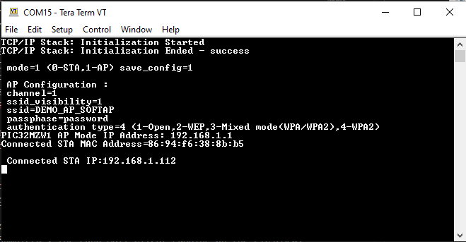

# Wifi-ethernet dual interface

This example application acts as a Soft AP with both wifi and ethernet interface enabled.

## Description

This application demonstrates how a user can enable both wifi and ethernet interface. The system shall run in freertos mode, and the application shall come up in AP mode.

## Downloading and building the application

To download or clone this application from Github, go to the [top level of the repository](https://github.com/Microchip-MPLAB-Harmony/wireless)

Path of the application within the repository is **apps/wifi_eth_dual_interface/firmware** .

To build the application, refer to the following table and open the project using its IDE.

| Project Name      | Description                                    |
| ----------------- | ---------------------------------------------- |
| pic32mz_w1_curiosity_freertos.X | MPLABX project for PIC32MZ W1 Curiosity Board |
|||

## Setting up PIC32MZ W1 Curiosity Board

- Connect the Debug USB port on the board to the computer using a micro USB cable
- On the GPIO Header (J207), connect U1RX (PIN 13) and U1TX (PIN 23) to TX and RX pin of any USB to UART converter
- Laptop (connect the ethernet cable between laptop and curiosity board)
- Mobile (wifi-interface)

## Running the Application

1. Open the project and launch Harmony3 configurator.
2.	Configure credentials for AP Mode.

3.	Save configurations and generate code via MHC 
4.	Build and program the generated code into the hardware using its IDE
5. Open the Terminal application (Ex.:Tera term) on the computer
6. Connect to the "USB to UART" COM port and configure the serial settings as follows:
    - Baud : 115200
    - Data : 8 Bits
    - Parity : None
    - Stop : 1 Bit
    - Flow Control : None

7.	The Board will come up in AP mode with AP mode IP address: 

8.	Connect wifi interface to "pic32mzw1" AP. Once wifi interface is connected, the assigned IP address will be visible in UART console:

9.  User can verify the connectivity status by pinging pic32mzw1 from laptop or mobile to respective interface ( ethernet or wifi ) :
