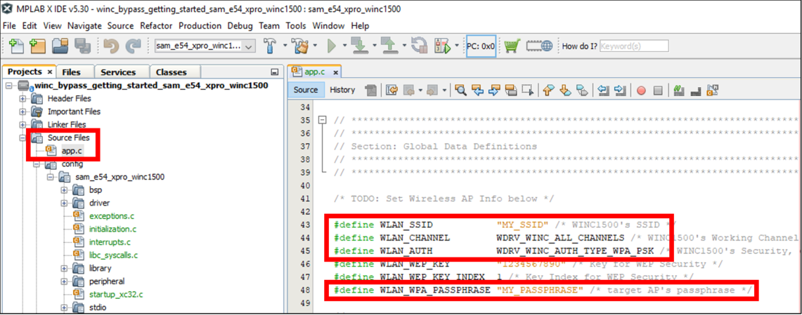

# WINC STA Bypass

This example compiles the WINC STA Bypass application.

## Description

This example implements a simple STA Client application on the SAM E54 Xplained Pro board with the ATWINC1500/3400 XPRO board where the WINC controller is in Bypass/Ethernet mode.

## Downloading and building the application

To download or clone this application from Github, go to the [top level of the repository](https://github.com/Microchip-MPLAB-Harmony/wireless)

Path of the application within the repository is **apps/wifi_winc_sta_bypass/firmware** .

To build the application, refer to the following table and open the project using its IDE.

| Project Name      | Description                                    |
| ----------------- | ---------------------------------------------- |
| sam_e54_xpro_winc1500.X | MPLABX project for SAME54 and WINC1500 Xplained pro |
| sam_e54_xpro_winc3400.X | MPLABX project for SAME54 and WINC3400 Xplained pro |
|||

## Setting up SAME54 Xplained Pro board

- Connect the ATWINCxx00 Xpro Wi-Fi board to **EXT1** XPRO Header of SAME54 Xplained baord.
- Connect the Debug USB port on the SAME54 Xplained Pro board to the computer using a micro USB cable

## Running the Application

 1. Open the project in MPLAB® X IDE and open the **app.c** file to change the access point parameters as shown in the picture below.
 
    

2. Build and program the generated code into the hardware using its IDE by using on-board EDBG programmer.

 1. Open a terminal application (eg: TeraTerm) and configure the baud rate for **115200**.
 
    
 
 1. Press the **Reset** button on the SAM E54 Xplained Ultra board.
 
 1. The following messages will be visible on the terminal window.
 
    
 
 1. Type **ping <PC's IP address>** in the terminal window and press **Enter** to see responses.
 
    
 
 1. You can also ping this board from your PC using cmd prompt as shown below.
 
    

# How to create this project from scratch

Following Wireless Wiki tutorial shows step-by-step process to create this project from scratch

[Create WINC1500 bypass mode demo from scratch](https://github.com/Microchip-MPLAB-Harmony/wireless/wiki/Create-your-first-winc-bypass-application)
